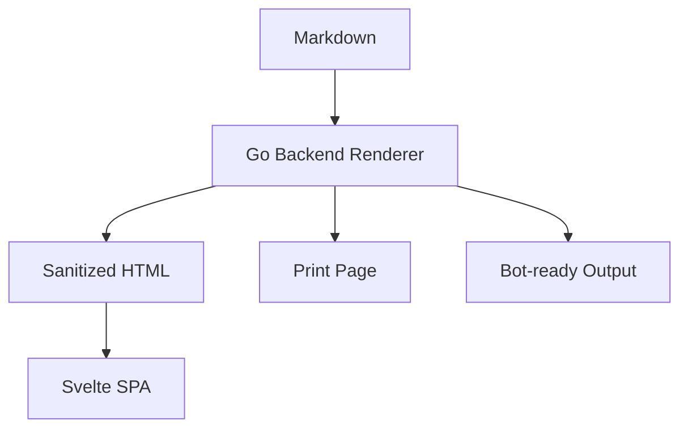

# Steelpage Starter Journey

A terminal-first starting point for building a Git-backed Markdown archive with comments, search, auth, print mode, and bot-ready output.

> Working idea: Markdown is the source of truth, SQLite is the context store, Git is the audit log, the Go backend is the canonical renderer, and a slim Svelte SPA is the reading/editing cockpit.

---

## 1. Project Goal

Build a small self-hosted system that:

- Serves Markdown files from a Git repository
- Renders Markdown on the backend, always
- Sends sanitized rendered HTML to the frontend
- Uses a slim Svelte/Vite SPA for fast UX
- Allows editing Markdown files from the frontend
- Allows adding comments to specific lines
- Stores comments, users, sessions, permissions, and search index in a file-based DB
- Uses Git commits as the audit log for document changes
- Automatically updates frontmatter when files change
- Provides a clean print mode
- Provides a `?botready=1` output mode optimized for AI agents and automation
- Supports simple whole-archive auth, local users, and later OIDC

Recommended first implementation:

```text
Go + SQLite + Goldmark + Chroma + Git CLI + Svelte/Vite SPA
```

Core rule:

```text
The backend renders Markdown.
The frontend displays rendered HTML and edits raw Markdown.
The frontend never becomes the canonical renderer.
```

---

## 2. Architecture

```text
Git repo
  /content
    README.md
    handbook/example.md
    private/team.md

SQLite file
  steelpage.db
    users
    sessions
    comments
    permissions
    documents
    documents_fts
    audit_events

Go backend
  API routes
  auth middleware
  Markdown rendering
  HTML sanitization
  frontmatter updates
  Git commits
  search indexing
  static SPA serving

Svelte SPA
  document tree
  document reader
  Markdown editor
  comment sidebar
  search overlay
  print trigger
  bot-ready link
```

The ideal deployment shape:

```text
one Go binary
one SQLite file
one Git-backed content directory
one embedded Svelte SPA
```

---

## 3. Suggested Repository Structure

```text
steelpage/
  cmd/
    steelpage/
      main.go

  internal/
    api/
    auth/
    comments/
    config/
    db/
    docs/
    frontmatter/
    gitstore/
    markdown/
    permissions/
    render/
    search/
    server/

  frontend/
    index.html
    package.json
    vite.config.ts
    tsconfig.json
    src/
      main.ts
      App.svelte
      lib/
        api.ts
        types.ts
      routes/
        DocumentView.svelte
        SearchView.svelte
        LoginView.svelte
      components/
        ArchiveTree.svelte
        CommentSidebar.svelte
        MarkdownEditor.svelte
        TopBar.svelte
      styles/
        app.css
        print.css

  migrations/
    001_init.sql

  content/
    README.md

  config.example.yaml
  go.mod
  README.md
```

---

## 4. Create the Project

```bash
mkdir steelpage
cd steelpage

git init

mkdir -p cmd/steelpage
mkdir -p internal/{api,auth,comments,config,db,docs,frontmatter,gitstore,markdown,permissions,render,search,server}
mkdir -p frontend/src/{lib,routes,components,styles}
mkdir -p migrations
mkdir -p content

go mod init github.com/YOUR_USER/steelpage
```

Create the first content file:

````bash
cat > content/README.md <<'EOF'
---
title: Welcome to Steelpage
created: 2026-05-20T00:00:00+02:00
updated: 2026-05-20T00:00:00+02:00
updated_by: system
version: 1
tags:
  - welcome
---

# Welcome to Steelpage

This is your first Git-backed Markdown document.



```go
package main

import "fmt"

func main() {
    fmt.Println("Hello, Steelpage")
}
```
EOF
````

Commit the initial archive:

```bash
git add .
git commit -m "Initial Steelpage archive"
```

---

## 5. Example Config

Create `config.example.yaml`:

```bash
cat > config.example.yaml <<'EOF'
repo:
  path: ./content
  branch: main
  commit_author_name: Steelpage
  commit_author_email: steelpage@local

server:
  bind: 127.0.0.1:8080
  base_url: http://localhost:8080

db:
  path: ./steelpage.db

auth:
  mode: local
  allow_anonymous_read: false

render:
  allow_raw_html: false
  mermaid: true
  code_highlighting: true
  sanitize_html: true

search:
  engine: sqlite_fts5

frontend:
  embedded_dist: ./frontend/dist
EOF
```

Then copy it for local use:

```bash
cp config.example.yaml config.yaml
```

---

## 6. SQLite Schema Draft

Create `migrations/001_init.sql`:

```bash
cat > migrations/001_init.sql <<'EOF'
CREATE TABLE IF NOT EXISTS users (
  id INTEGER PRIMARY KEY AUTOINCREMENT,
  username TEXT NOT NULL UNIQUE,
  password_hash TEXT,
  oidc_provider TEXT,
  oidc_subject TEXT,
  role TEXT NOT NULL DEFAULT 'user',
  created_at TEXT NOT NULL
);

CREATE TABLE IF NOT EXISTS sessions (
  id TEXT PRIMARY KEY,
  user_id INTEGER NOT NULL,
  expires_at TEXT NOT NULL,
  FOREIGN KEY (user_id) REFERENCES users(id)
);

CREATE TABLE IF NOT EXISTS documents (
  path TEXT PRIMARY KEY,
  title TEXT,
  slug TEXT,
  sha TEXT,
  frontmatter_json TEXT,
  visibility TEXT NOT NULL DEFAULT 'private',
  indexed_at TEXT
);

CREATE TABLE IF NOT EXISTS comments (
  id INTEGER PRIMARY KEY AUTOINCREMENT,
  path TEXT NOT NULL,
  line_start INTEGER NOT NULL,
  line_end INTEGER NOT NULL,
  anchor_text TEXT,
  document_sha TEXT,
  author_id INTEGER NOT NULL,
  body TEXT NOT NULL,
  status TEXT NOT NULL DEFAULT 'open',
  created_at TEXT NOT NULL,
  updated_at TEXT NOT NULL,
  resolved_at TEXT,
  FOREIGN KEY (author_id) REFERENCES users(id)
);

CREATE TABLE IF NOT EXISTS permissions (
  id INTEGER PRIMARY KEY AUTOINCREMENT,
  subject_type TEXT NOT NULL,
  subject_id TEXT NOT NULL,
  path_glob TEXT NOT NULL,
  permission TEXT NOT NULL
);

CREATE TABLE IF NOT EXISTS audit_events (
  id INTEGER PRIMARY KEY AUTOINCREMENT,
  actor_id INTEGER,
  action TEXT NOT NULL,
  path TEXT NOT NULL,
  old_sha TEXT,
  new_sha TEXT,
  git_commit TEXT,
  created_at TEXT NOT NULL
);

CREATE VIRTUAL TABLE IF NOT EXISTS documents_fts USING fts5(
  path UNINDEXED,
  title,
  headings,
  body,
  frontmatter
);
EOF
```

---

## 7. Backend Dependencies

Start modestly:

```bash
go get github.com/go-chi/chi/v5
go get github.com/mattn/go-sqlite3
go get github.com/yuin/goldmark
go get github.com/yuin/goldmark-highlighting/v2
go get github.com/alecthomas/chroma/v2
go get github.com/microcosm-cc/bluemonday
go get gopkg.in/yaml.v3
```

Optional later:

```bash
go get github.com/gorilla/sessions
go get golang.org/x/crypto/bcrypt
```

Why `bluemonday`?

```text
Markdown can become HTML.
HTML can become a doorway.
Sanitization keeps the archive safe.
```

---

## 8. Frontend Setup: Svelte + Vite

Create the Svelte frontend:

```bash
cd frontend
npm create vite@latest . -- --template svelte-ts
npm install
cd ..
```

Recommended frontend packages:

```bash
cd frontend
npm install @codemirror/state @codemirror/view @codemirror/lang-markdown
npm install mermaid
cd ..
```

The SPA should be slim. It should not own document rendering. Its job is to orchestrate the experience.

Frontend responsibilities:

```text
- Fetch document metadata
- Display backend-rendered sanitized HTML
- Edit raw Markdown
- Send raw Markdown to backend on save
- Display line comments
- Trigger search
- Trigger print
- Link to bot-ready output
```

Frontend non-responsibilities:

```text
- Canonical Markdown rendering
- HTML sanitization
- Permission enforcement
- Git commits
- Search indexing
- Frontmatter mutation
```

---

## 9. API Shape

The Go backend exposes the archive as an API.

```text
GET    /api/tree
GET    /api/docs/:path
PUT    /api/docs/:path
POST   /api/render
GET    /api/search?q=...
GET    /api/comments?path=...
POST   /api/comments
PATCH  /api/comments/:id
GET    /api/me
POST   /api/login
POST   /api/logout
```

Suggested `GET /api/docs/:path` response:

```json
{
  "path": "README.md",
  "title": "Welcome to Steelpage",
  "frontmatter": {
    "title": "Welcome to Steelpage",
    "version": 1,
    "tags": ["welcome"]
  },
  "markdown": "# Welcome to Steelpage\n...",
  "html": "<h1 id=\"welcome-to-steelpage\">Welcome to Steelpage</h1>...",
  "sha": "abc123",
  "updated": "2026-05-20T00:00:00+02:00",
  "comments": []
}
```

Important:

```text
The `html` field comes from the backend renderer.
The `markdown` field is used only for editing.
```

Suggested `POST /api/render` request:

```json
{
  "path": "README.md",
  "markdown": "# Preview"
}
```

Suggested `POST /api/render` response:

```json
{
  "html": "<h1 id=\"preview\">Preview</h1>"
}
```

Use this endpoint for editor preview. Even preview rendering should go through the backend.

---

## 10. Backend Rendering Rule

Steelpage has one rendering law:

```text
All Markdown rendering goes through the Go backend.
```

This applies to:

```text
- normal document view
- editor preview
- print view
- bot-ready output
- search indexing
- future exports
```

Rendering pipeline:

```text
raw Markdown
→ split frontmatter
→ parse frontmatter
→ render Markdown with Goldmark
→ apply syntax highlighting
→ preserve Mermaid blocks
→ sanitize HTML
→ add heading anchors
→ add line anchors if needed
→ return HTML to frontend
```

Mermaid can still execute client-side, but the backend decides what a Mermaid block is.

Recommended Mermaid output shape from backend:

```html
<pre class="mermaid">flowchart TD
  A --> B
</pre>
```

Then Svelte hydrates Mermaid diagrams after the HTML is mounted.

---

## 11. Minimal Backend Server Skeleton

Create `cmd/steelpage/main.go`:

````bash
cat > cmd/steelpage/main.go <<'EOF'
package main

import (
	"bytes"
	"encoding/json"
	"fmt"
	"log"
	"net/http"
	"os"
	"path/filepath"
	"strings"

	"github.com/go-chi/chi/v5"
	"github.com/microcosm-cc/bluemonday"
	"github.com/yuin/goldmark"
	highlighting "github.com/yuin/goldmark-highlighting/v2"
	"github.com/yuin/goldmark/extension"
	"github.com/yuin/goldmark/parser"
	"github.com/yuin/goldmark/renderer/html"
)

type DocumentResponse struct {
	Path       string         `json:"path"`
	Title      string         `json:"title"`
	Frontmatter map[string]any `json:"frontmatter"`
	Markdown   string         `json:"markdown"`
	HTML       string         `json:"html"`
	SHA        string         `json:"sha"`
	Updated    string         `json:"updated"`
	Comments   []any          `json:"comments"`
}

type RenderRequest struct {
	Path     string `json:"path"`
	Markdown string `json:"markdown"`
}

type RenderResponse struct {
	HTML string `json:"html"`
}

func main() {
	repoPath := "./content"

	md := goldmark.New(
		goldmark.WithExtensions(
			extension.GFM,
			highlighting.NewHighlighting(
				highlighting.WithStyle("github"),
			),
		),
		goldmark.WithParserOptions(
			parser.WithAutoHeadingID(),
		),
		goldmark.WithRendererOptions(
			html.WithUnsafe(),
		),
	)

	sanitizer := bluemonday.UGCPolicy()

	r := chi.NewRouter()

	r.Get("/api/docs/*", func(w http.ResponseWriter, r *http.Request) {
		docPath := chi.URLParam(r, "*")

		fullPath, ok := safeJoin(repoPath, docPath)
		if !ok {
			http.Error(w, "invalid path", http.StatusBadRequest)
			return
		}

		body, err := os.ReadFile(fullPath)
		if err != nil {
			http.Error(w, "document not found", http.StatusNotFound)
			return
		}

		raw := string(body)
		frontmatter, markdown := splitFrontmatter(raw)

		rendered, err := renderMarkdown(md, sanitizer, markdown)
		if err != nil {
			http.Error(w, "render failed", http.StatusInternalServerError)
			return
		}

		resp := DocumentResponse{
			Path:        docPath,
			Title:       titleFromFrontmatter(frontmatter, docPath),
			Frontmatter: frontmatter,
			Markdown:    markdown,
			HTML:        rendered,
			SHA:         "",
			Updated:     "",
			Comments:    []any{},
		}

		writeJSON(w, resp)
	})

	r.Post("/api/render", func(w http.ResponseWriter, r *http.Request) {
		var req RenderRequest
		if err := json.NewDecoder(r.Body).Decode(&req); err != nil {
			http.Error(w, "bad request", http.StatusBadRequest)
			return
		}

		rendered, err := renderMarkdown(md, sanitizer, req.Markdown)
		if err != nil {
			http.Error(w, "render failed", http.StatusInternalServerError)
			return
		}

		writeJSON(w, RenderResponse{HTML: rendered})
	})

	r.Get("/docs/*", func(w http.ResponseWriter, r *http.Request) {
		// Later this should serve the embedded Svelte SPA shell.
		// The SPA then calls /api/docs/:path.
		w.Header().Set("Content-Type", "text/html; charset=utf-8")
		fmt.Fprint(w, "<div id=\"app\">Steelpage SPA shell goes here.</div>")
	})

	r.Get("/", func(w http.ResponseWriter, r *http.Request) {
		http.Redirect(w, r, "/docs/README.md", http.StatusFound)
	})

	log.Println("Steelpage listening on http://127.0.0.1:8080")
	log.Fatal(http.ListenAndServe("127.0.0.1:8080", r))
}

func renderMarkdown(md goldmark.Markdown, sanitizer *bluemonday.Policy, markdown string) (string, error) {
	var buf bytes.Buffer
	if err := md.Convert([]byte(markdown), &buf); err != nil {
		return "", err
	}

	// Canonical backend sanitization.
	return sanitizer.Sanitize(buf.String()), nil
}

func splitFrontmatter(raw string) (map[string]any, string) {
	// Minimal placeholder parser.
	// Replace with real YAML parsing in internal/frontmatter.
	if !strings.HasPrefix(raw, "---\n") {
		return map[string]any{}, raw
	}

	rest := strings.TrimPrefix(raw, "---\n")
	parts := strings.SplitN(rest, "\n---\n", 2)
	if len(parts) != 2 {
		return map[string]any{}, raw
	}

	// For now, keep parsing simple in the skeleton.
	return map[string]any{}, parts[1]
}

func titleFromFrontmatter(frontmatter map[string]any, path string) string {
	if title, ok := frontmatter["title"].(string); ok && title != "" {
		return title
	}
	return filepath.Base(path)
}

func safeJoin(root string, requested string) (string, bool) {
	cleaned := filepath.Clean("/" + requested)
	fullPath := filepath.Join(root, cleaned)

	rootAbs, err := filepath.Abs(root)
	if err != nil {
		return "", false
	}

	fullAbs, err := filepath.Abs(fullPath)
	if err != nil {
		return "", false
	}

	if !strings.HasPrefix(fullAbs, rootAbs) {
		return "", false
	}

	return fullAbs, true
}

func writeJSON(w http.ResponseWriter, value any) {
	w.Header().Set("Content-Type", "application/json; charset=utf-8")
	_ = json.NewEncoder(w).Encode(value)
}
EOF
````

Run it:

```bash
go run ./cmd/steelpage
```

Open:

```text
http://127.0.0.1:8080/api/docs/README.md
http://127.0.0.1:8080/docs/README.md
```

At this point, the backend renders Markdown and returns sanitized HTML.

The first lantern is lit.

---

## 12. Minimal Svelte App Skeleton

Create `frontend/src/lib/types.ts`:

```bash
cat > frontend/src/lib/types.ts <<'EOF'
export type SteelpageDocument = {
  path: string;
  title: string;
  frontmatter: Record<string, unknown>;
  markdown: string;
  html: string;
  sha: string;
  updated: string;
  comments: unknown[];
};
EOF
```

Create `frontend/src/lib/api.ts`:

```bash
cat > frontend/src/lib/api.ts <<'EOF'
import type { SteelpageDocument } from "./types";

export async function getDocument(path: string): Promise<SteelpageDocument> {
  const res = await fetch(`/api/docs/${path}`);

  if (!res.ok) {
    throw new Error(`Failed to load document: ${res.status}`);
  }

  return res.json();
}

export async function renderMarkdown(path: string, markdown: string): Promise<string> {
  const res = await fetch("/api/render", {
    method: "POST",
    headers: {
      "Content-Type": "application/json",
    },
    body: JSON.stringify({ path, markdown }),
  });

  if (!res.ok) {
    throw new Error(`Failed to render Markdown: ${res.status}`);
  }

  const data = await res.json();
  return data.html;
}
EOF
```

Create `frontend/src/routes/DocumentView.svelte`:

```bash
cat > frontend/src/routes/DocumentView.svelte <<'EOF'
<script lang="ts">
  import { onMount, tick } from "svelte";
  import mermaid from "mermaid";
  import { getDocument, renderMarkdown } from "../lib/api";
  import type { SteelpageDocument } from "../lib/types";

  let path = "README.md";
  let doc: SteelpageDocument | null = null;
  let error = "";
  let editing = false;
  let draft = "";
  let previewHtml = "";

  mermaid.initialize({ startOnLoad: false });

  onMount(async () => {
    await loadDocument(path);
  });

  async function loadDocument(nextPath: string) {
    error = "";
    try {
      doc = await getDocument(nextPath);
      draft = doc.markdown;
      previewHtml = doc.html;
      await hydrateMermaid();
    } catch (err) {
      error = err instanceof Error ? err.message : "Unknown error";
    }
  }

  async function updatePreview() {
    previewHtml = await renderMarkdown(path, draft);
    await hydrateMermaid();
  }

  async function hydrateMermaid() {
    await tick();
    const nodes = document.querySelectorAll(".document-body .mermaid");
    for (const node of nodes) {
      const el = node as HTMLElement;
      if (el.dataset.processed) continue;
      try {
        const id = `mermaid-${crypto.randomUUID()}`;
        const source = el.textContent ?? "";
        const result = await mermaid.render(id, source);
        el.innerHTML = result.svg;
        el.dataset.processed = "true";
      } catch {
        // Keep the original Mermaid text visible if rendering fails.
      }
    }
  }
</script>

{#if error}
  <p class="error">{error}</p>
{:else if doc}
  <div class="document-shell">
    <header class="topbar">
      <div>
        <strong>{doc.title}</strong>
        <span>{doc.path}</span>
      </div>

      <nav>
        <button on:click={() => (editing = !editing)}>
          {editing ? "Read" : "Edit"}
        </button>

        <button on:click={() => window.print()}>
          Print
        </button>

        <a href={`/docs/${doc.path}?botready=1`} target="_blank">
          Bot-ready
        </a>
      </nav>
    </header>

    {#if editing}
      <section class="editor-grid">
        <textarea bind:value={draft} on:input={updatePreview}></textarea>

        <article class="document-body">
          {@html previewHtml}
        </article>
      </section>
    {:else}
      <article class="document-body">
        {@html doc.html}
      </article>
    {/if}
  </div>
{:else}
  <p>Loading...</p>
{/if}
EOF
```

Create `frontend/src/App.svelte`:

```bash
cat > frontend/src/App.svelte <<'EOF'
<script lang="ts">
  import DocumentView from "./routes/DocumentView.svelte";
  import "./styles/app.css";
  import "./styles/print.css";
</script>

<DocumentView />
EOF
```

---

## 13. Minimal Frontend Styles

Create `frontend/src/styles/app.css`:

```bash
cat > frontend/src/styles/app.css <<'EOF'
:root {
  font-family:
    Inter, ui-sans-serif, system-ui, -apple-system, BlinkMacSystemFont,
    "Segoe UI", sans-serif;
  color: #172033;
  background: #f7f4ee;
}

body {
  margin: 0;
}

button,
a {
  font: inherit;
}

.document-shell {
  min-height: 100vh;
}

.topbar {
  position: sticky;
  top: 0;
  z-index: 10;
  display: flex;
  justify-content: space-between;
  gap: 1rem;
  padding: 0.85rem 1rem;
  background: rgba(255, 255, 255, 0.92);
  border-bottom: 1px solid #ded8cc;
  backdrop-filter: blur(10px);
}

.topbar span {
  display: block;
  color: #6f6a60;
  font-size: 0.85rem;
}

.topbar nav {
  display: flex;
  gap: 0.5rem;
  align-items: center;
}

.topbar button,
.topbar a {
  border: 1px solid #cfc7b8;
  border-radius: 999px;
  background: white;
  color: #172033;
  padding: 0.4rem 0.75rem;
  text-decoration: none;
  cursor: pointer;
}

.document-body {
  max-width: 820px;
  margin: 0 auto;
  padding: 3rem 1.25rem 6rem;
  line-height: 1.65;
}

.document-body pre {
  overflow: auto;
  padding: 1rem;
  border-radius: 0.75rem;
  background: #1f2430;
  color: #f4f4f4;
}

.document-body code {
  font-family:
    "JetBrains Mono", "SFMono-Regular", Consolas, "Liberation Mono", monospace;
}

.editor-grid {
  display: grid;
  grid-template-columns: minmax(320px, 1fr) minmax(320px, 1fr);
  min-height: calc(100vh - 60px);
}

.editor-grid textarea {
  width: 100%;
  min-height: calc(100vh - 60px);
  box-sizing: border-box;
  border: 0;
  border-right: 1px solid #ded8cc;
  padding: 1rem;
  font:
    14px/1.55 "JetBrains Mono", "SFMono-Regular", Consolas,
    "Liberation Mono", monospace;
  resize: none;
}

.error {
  padding: 1rem;
  color: #9b1c1c;
}

@media (max-width: 860px) {
  .editor-grid {
    grid-template-columns: 1fr;
  }

  .editor-grid textarea {
    min-height: 45vh;
    border-right: 0;
    border-bottom: 1px solid #ded8cc;
  }
}
EOF
```

Create `frontend/src/styles/print.css`:

```bash
cat > frontend/src/styles/print.css <<'EOF'
@media print {
  .topbar,
  nav,
  aside,
  .comments,
  .no-print {
    display: none !important;
  }

  :root,
  body {
    color: #111;
    background: white;
  }

  .document-body {
    max-width: none;
    margin: 0;
    padding: 0;
    font: 11pt/1.45 system-ui, sans-serif;
  }

  pre,
  blockquote,
  table {
    break-inside: avoid;
  }

  a {
    color: inherit;
    text-decoration: none;
  }

  a[href]::after {
    content: " (" attr(href) ")";
    font-size: 9pt;
  }
}
EOF
```

---

## 14. Build and Embed the SPA Later

During development, run backend and frontend separately:

```bash
# terminal 1
go run ./cmd/steelpage

# terminal 2
cd frontend
npm run dev
```

Later, build the SPA:

```bash
cd frontend
npm run build
cd ..
```

Then embed `frontend/dist` in the Go binary:

```go
//go:embed frontend/dist/*
var frontendFS embed.FS
```

Final deployment target:

```text
./steelpage serve
```

That should serve:

```text
- API routes
- embedded Svelte SPA
- Git-backed content
- SQLite DB
```

---

## 15. Git-backed Editing

For every frontend save:

```text
1. SPA sends raw Markdown to PUT /api/docs/:path
2. Backend loads existing file
3. Backend parses frontmatter
4. Backend applies frontmatter updates
5. Backend writes Markdown file
6. Backend runs git add
7. Backend runs git commit
8. Backend re-renders document
9. Backend re-indexes search
10. Backend returns updated document response
```

Save response:

```json
{
  "path": "README.md",
  "title": "Welcome to Steelpage",
  "markdown": "...",
  "html": "...",
  "sha": "def456",
  "updated": "2026-05-20T12:30:00+02:00"
}
```

Frontmatter update rule:

```text
if created is missing:
  created = now

updated = now
updated_by = current username
version = version + 1
```

Example:

```yaml
---
title: Example Document
created: 2026-05-20T10:00:00+02:00
updated: 2026-05-20T12:15:00+02:00
updated_by: markus
version: 3
tags:
  - internal
  - handbook
---
```

---

## 16. Git Commit Message Convention

Use boring, searchable messages:

```text
docs: update README.md
docs: create projects/demo.md
docs: delete old-note.md
comments: resolve comment 42 on README.md
```

For document edits, each save should produce a Git commit.

Example command sequence:

```bash
git -C ./content add README.md
git -C ./content commit -m "docs: update README.md" \
  --author "Steelpage <steelpage@local>"
```

You may also choose to keep `content/` as its own Git repository inside the app directory.

---

## 17. Comments on Lines

Line comments are deceptively deep water.

A simple v1:

```text
comment.path = "README.md"
comment.line_start = 42
comment.line_end = 42
comment.anchor_text = "the original line text"
comment.document_sha = "abc123"
```

When a file changes, try to re-anchor comments by:

```text
1. Same line still has same text → keep
2. Nearby ±10 lines has same text → move
3. Fuzzy match exists → move and mark "relocated"
4. No match → mark "orphaned"
```

The frontend can display comment anchors beside rendered HTML, but the backend should decide the source line mapping.

---

## 18. Search

For v1:

```text
SQLite FTS5
```

Index:

```text
path
title
headings
body
tags
frontmatter
```

Ranking idea:

```text
title match > heading match > body match > comment match
```

Search flow:

```text
1. Markdown changes
2. Backend parses frontmatter
3. Backend extracts plain text and headings
4. Backend updates documents_fts
5. SPA calls /api/search?q=...
6. Backend returns ranked results
```

Do not let the frontend own search indexing.

---

## 19. Auth

Start simple, but leave doors open.

Auth modes:

```text
auth.mode = none
auth.mode = basic
auth.mode = local
auth.mode = oidc
auth.mode = mixed
```

Recommended implementation order:

```text
1. Whole-archive login
2. Local users
3. Password hashing
4. Sessions
5. Path-based permissions
6. OIDC
```

Permission examples:

```text
/
  authenticated: read

/private/**
  admin: write
  engineering: read

/projects/acme/**
  acme-team: read, comment
  admin: write
```

The backend enforces all permissions. The frontend only hides or shows UI affordances.

---

## 20. Output Modes

### Human SPA Mode

```text
/docs/README.md
```

Serves the Svelte shell. The SPA calls:

```text
/api/docs/README.md
```

### Print Mode

```text
/docs/README.md?print=1
```

Can still use the SPA, but should apply print styles and optionally auto-open print.

### Bot-ready Markdown

```text
/docs/README.md?botready=1
```

Returns clean Markdown from the backend.

Suggested shape:

```markdown
# Document Title

Path: README.md
Updated: 2026-05-20T12:15:00+02:00
Git SHA: abc123
Tags: internal, handbook

---

## Content

...

---

## Open Comments

- Line 42, Markus: Clarify this paragraph.
```

### Bot-ready JSON

```text
/docs/README.md?botready=1&format=json
```

Suggested shape:

```json
{
  "path": "README.md",
  "title": "Document Title",
  "frontmatter": {},
  "markdown": "...",
  "html": "...",
  "comments": [],
  "git": {
    "sha": "abc123",
    "updated": "2026-05-20T12:15:00+02:00"
  }
}
```

The backend owns all bot-ready output.

---

## 21. First Milestones

### Milestone 1: Backend Markdown Renderer

- [ ] Load files from `content/`
- [ ] Reject path traversal like `../../secrets`
- [ ] Parse frontmatter
- [ ] Render Markdown with Goldmark
- [ ] Add code highlighting
- [ ] Preserve Mermaid blocks
- [ ] Sanitize HTML
- [ ] Return JSON with `markdown` and `html`

### Milestone 2: Svelte Reader

- [ ] Create Svelte/Vite app
- [ ] Fetch `/api/docs/README.md`
- [ ] Render backend-provided HTML
- [ ] Hydrate Mermaid diagrams
- [ ] Add print button
- [ ] Add bot-ready link

### Milestone 3: Editor Preview

- [ ] Add edit mode
- [ ] Edit raw Markdown
- [ ] Send draft to `/api/render`
- [ ] Display backend-rendered preview
- [ ] Debounce preview requests

### Milestone 4: Git-backed Save

- [ ] Add `PUT /api/docs/:path`
- [ ] Update frontmatter on save
- [ ] Write file
- [ ] Run `git add`
- [ ] Run `git commit`
- [ ] Return re-rendered document

### Milestone 5: Comments

- [ ] Render source line anchors
- [ ] Add comment form per line
- [ ] Store comments in SQLite
- [ ] Display comments in sidebar
- [ ] Re-anchor comments after edits where possible

### Milestone 6: Search

- [ ] Index Markdown into SQLite FTS5
- [ ] Re-index on document save
- [ ] Add `/api/search?q=...`
- [ ] Add Svelte search overlay

### Milestone 7: Auth

- [ ] Whole-archive login
- [ ] Local users
- [ ] Password hashing
- [ ] Sessions
- [ ] Path-based permissions
- [ ] Later: OIDC

---

## 22. Implementation Order

Recommended order:

```text
1. Raw file loading
2. Safe path resolution
3. Backend Markdown rendering
4. Frontmatter parsing
5. Sanitized HTML response
6. Svelte document viewer
7. Mermaid hydration
8. Backend preview endpoint
9. Editor mode
10. Git commit on save
11. SQLite migrations
12. Comments
13. Search
14. Auth
15. Print mode polish
16. Bot-ready JSON
17. OIDC
```

Do not start with OIDC. Do not start with perfect comments. Do not start with collaborative editing.

Start with a page that opens, renders through the backend, edits, previews through the backend, saves, and commits.

That is the heartbeat.

---

## 23. Design Principles

Keep these carved into the lintel:

```text
Markdown is the source of truth.
The backend is the renderer.
The frontend is the cockpit.
SQLite stores context, not canonical document content.
Git remembers every document change.
Search is rebuildable.
Permissions are explicit.
The print view is quiet.
The bot view is clean.
The human view is warm.
```

---

## 24. North Star

Steelpage should feel like:

```text
a wiki with a filesystem soul,
a document archive with a Git memory,
a slim Svelte cockpit for humans,
and a clean backend-rendered signal for bots.
```
